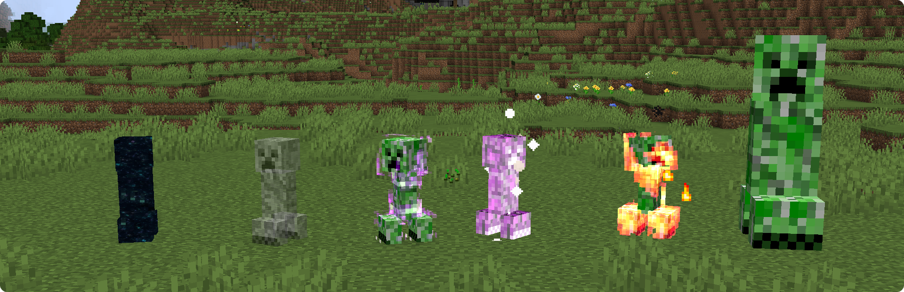
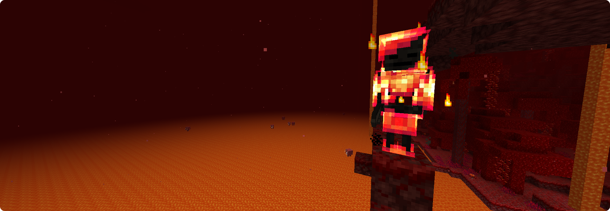

### Variant

---

Introduces fun visual & mechanical entity modifiers to spice up vanilla entities.

Available modifiers ([visit the wiki page for descriptions](https://github.com/Draylar/variant/wiki)):
- Ghostly
- Thundering
- Shiny
- Flame
- Mega

How about a Thundering Polar Bear?

Or a fiery Wither Skeleton?

### License

Variant is available under the MIT license. 